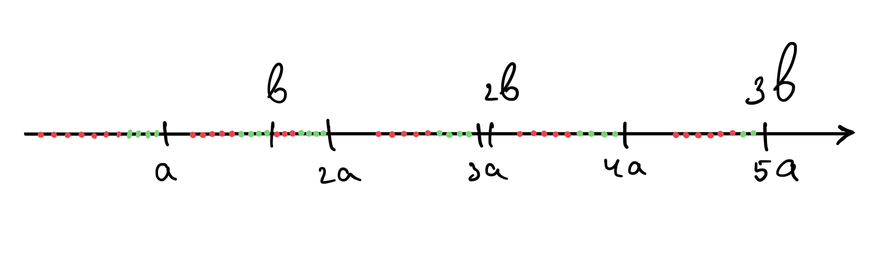
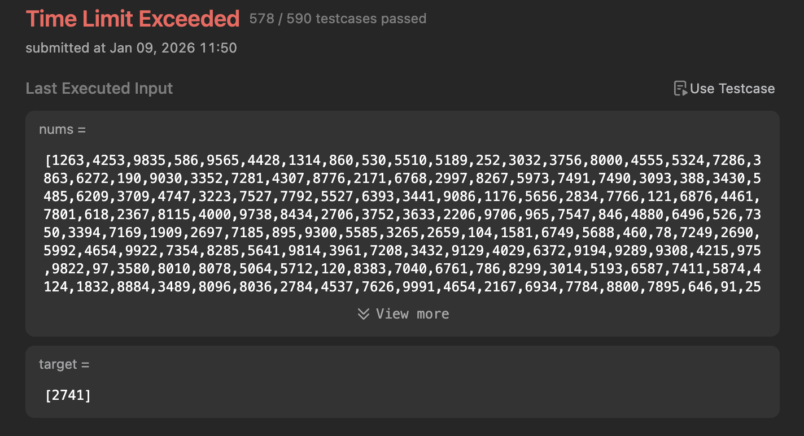

# Gridy vs. Dynamic

I’d also like to comment on [this](./statement.md) problem! It turned out to be both interesting and unexpected.

In my original solution (`Solution`), I dived into modular arithmetic and made the following sketch:  
  
Notice that it’s enough to keep 4 maxima for each `target[i]`, 2 maxima for each combination of 2 or 3 targets, and 1 maximum for the combination of all 4 (assuming `len(target) == 4`).  
This led me to write a greedy algorithm: we find the specified maxima, reducing the list of `nums` numbers that need to “cover” `target` down to 35 elements (instead of `5 * 10⁴`). From there, the problem can be solved by a simple brute-force enumeration in `O(1) = O(1.5 * 10⁶)`.

The `Solution` performs a linear search and then a brute-force enumeration in constant time, giving a total complexity of `O(35 * N)`, whereas `Solution2` gives `O(256 * N)`.

The real speedup of the greedy algorithm, as shown by benchmarking, turned out to be even greater than `256/35`:
```
$ python3 ./benchmark.py
====== TIMEIT BENCHMARK ======
Solution 1 total: 4.832357 sec
Solution 2 total: 99.242516 sec

Solution 1 avg: 0.161079 sec
Solution 2 avg: 3.308084 sec

Speedup: 20.54x
```

LeetCode agreed, showing the following results:  
* for `Solution2` (bitmask dynamic):

* for `Solution` (gridy math):


So,
> use math when you can.
